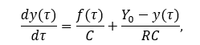

## Task 1. Modeling controlled object ##
Let get some object to be controlled. We want to control its temperature, which can be described by this differential equation:

where τ – time (discrete moments 1,2,3…n); y_τ – input temperature; f_τ – input warm; Y_0 – room temperature; C,RC – some constants.

After transformation we get these linear and nonlinear models:

## Task ##
write program (C++), which simulates this object temperature.